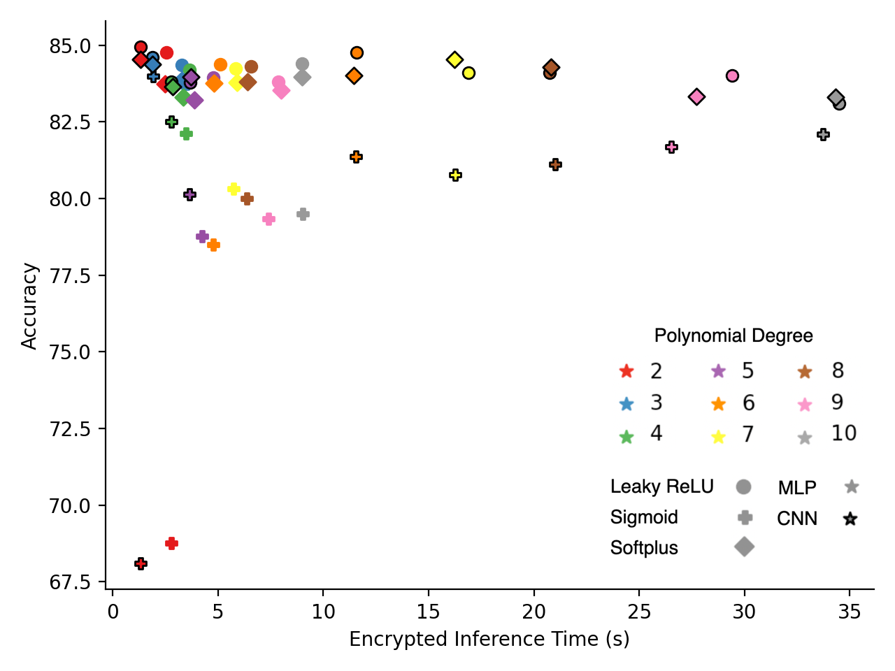

# Exploring Private Inference with FHE

To train all 54 model configurations, run ```python3 train_models.py``` (note, this will take a while). 
To use our uploaded checkpoints to verify the test results, run ```python3 test_models.py```. 
To verify our encrypted inference runtimes, run ```python3 time_encrypted_inference.py```. This will again take a while.


## Overview 

The objective of this project was to investigate the trade-off between accuracy and runtime in private inference using fully homomorphic encryption (FHE). Given that computations using FHE are limited to addition and multiplication, it is necessary to use polynomial activation functions in any neural network implementation. Our hypothesis is that higher degree polynomial approximations can more accurately capture commonly used activation functions in deep learning, but at the cost of increased runtime in FHE. Therefore, we believe there exists an optimal point where the marginal improvements in model accuracy are no longer worth large increases in encrypted inference time. The core result of our paper can be seen below,




